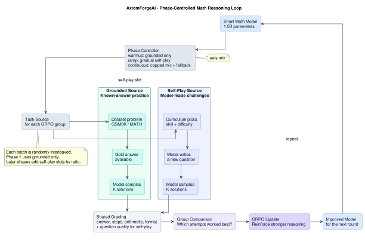
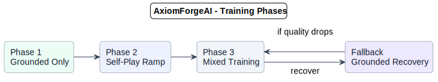

# AxiomForgeAI

[](https://github.com/meta-pytorch/OpenEnv)

*A self-improving math environment where a model practices on verified problems, generates new challenges when ready, and learns from solution attempts whose reasoning steps and final answers agree.*

## The Problem

Math reasoning models can fail in two different ways. Sometimes the setup, arithmetic, and algebraic steps look reasonable, but the final answer is wrong. Sometimes the final answer is right, but the reasoning that produced it is incomplete, inconsistent, or hard to trust.

For a math user, both failures matter. Checking only the final answer misses where the solution went off track. Checking only the steps misses whether the work actually reaches the right result. The useful signal is the agreement between the reasoning path and the final answer.

This project builds a practice loop around that signal. The model first works on problems with known answers, gets feedback on both the chain of reasoning and the final result, and only then starts generating new challenges for itself. The constraint is intentionally small: a 1.5B math model.

## The Environment

The environment is a practice loop for math reasoning. Each training group starts with one problem, asks the model for multiple solution attempts, scores those attempts from several angles, and uses GRPO to reinforce the attempts that are stronger than the rest of the group.



The environment has two task sources:

- **Grounded source:** A dataset problem from GSM8K / MATH comes with a known final answer. This gives the environment a reliable anchor for checking whether the model actually reached the right result.
- **Self-play source:** The curriculum selects a target skill and difficulty. The model writes a new question, then samples multiple solutions to that question. This adds practice beyond static datasets, but only after the grounded signal is stable enough.

Both sources feed the same scoring and update loop. For every selected problem, the model samples `K` candidate solutions. The environment checks final-answer correctness when a gold answer exists, scores reasoning quality with a PRM, checks chain consistency and symbolic arithmetic where possible, checks answer formatting, and scores self-generated questions for clarity, novelty, difficulty fit, and solvability.

GRPO then compares the `K` attempts against each other. The model is not rewarded for a solution in isolation; the strongest attempt in the group becomes the direction for learning. Training starts grounded-only, gradually mixes in self-play groups, and falls back to grounded practice if generated-question quality or answer correctness drops.

## How Self-Improvement Works

Self-improvement comes from turning each problem into a small comparison. The model does not produce one solution and move on; the environment samples several attempts, scores each attempt, and asks which reasoning path was strongest.

GRPO uses that within-group comparison as the learning signal. Attempts with correct answers, stronger reasoning chains, and cleaner final-answer format are reinforced. Attempts with broken chains or unsupported answers become weaker examples.

```text
practice -> sample attempts -> verify steps and answer -> compare -> reinforce -> adjust difficulty
```

## Reward System

The reward is designed to avoid a common math-training failure: optimizing for either the final answer or the reasoning trace alone. A good solution should reach the right answer, explain the path clearly, and keep the final result consistent with the steps that produced it.

| Signal | What it checks | Why it matters |
| --- | --- | --- |
| Final answer | Matches the gold answer when one exists | Keeps grounded problems tied to objective correctness |
| Process score | PRM score over the reasoning steps | Rewards clear mathematical progress, not just the last line |
| Chain consistency | Correct-prefix and step-answer consistency signals | Gives partial learning signal when a solution goes wrong midway |
| Format | Parseable final answer and clean response structure | Makes automatic grading reliable |
| Question quality | Topic fit, difficulty fit, clarity, novelty, and solvability | Keeps self-play from generating vague or useless practice tasks |

Grounded problems use the gold answer as the anchor. Self-play problems add a question-quality score before the solution reward is trusted. Both paths produce one combined score for each sampled attempt, and GRPO uses those scores only in comparison with the other attempts from the same problem.

```text
grounded: answer correctness + process score + chain consistency + format
self-play: question quality + solution quality
both -> one combined score per attempt -> GRPO compares attempts within the group
```

## Training Phases

Training follows a simple three-phase schedule. It starts with grounded-only practice so the model learns to keep answers and reasoning stable on problems with known solutions. Self-play is then introduced gradually, while grounded questions remain as an anchor. Once both are stable, training continues with a mixed task source and falls back to grounded-only batches if answer quality drops.



## Results

## Why It Matters

Low-cost self-improvement for compact math models matters because many useful deployments cannot assume large hosted models, expensive training loops, or public data movement. A 1.5B parameter model is small enough to make local experimentation realistic, but still capable enough to expose the hard part: reasoning does not improve unless the system can turn mistakes into structured practice.

AxiomForgeAI is also a reusable pattern. Math is the first domain because verification is unusually clear, but the same environment idea applies to other tasks where attempts can be checked, compared, and turned into reward: code, logic, structured data transformations, and scientific problem solving.

## Quick Start

AxiomForgeAI is built on the OpenEnv standard and exposes a Gym-style `reset` / `step` interface.

```bash
docker build -t AxiomForgeAI-env:latest -f server/Dockerfile .
```

```bash
openenv push --namespace your-hf-username
```

The deployed Space provides a `/ws` WebSocket endpoint for RL training loops.

---
*Engineered for the OpenEnv Hackathon India 2026*
