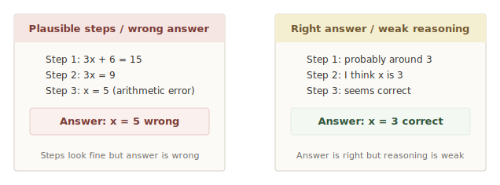
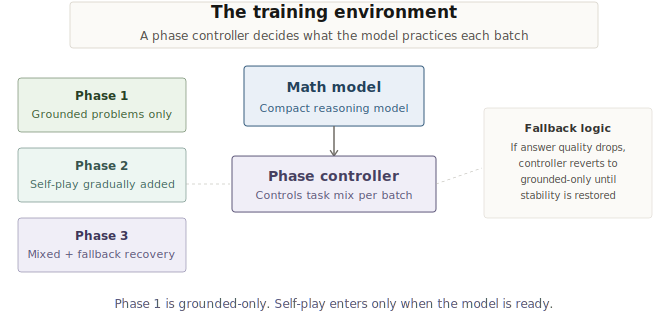
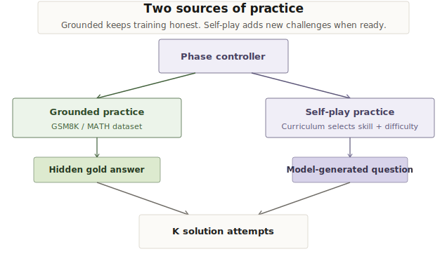
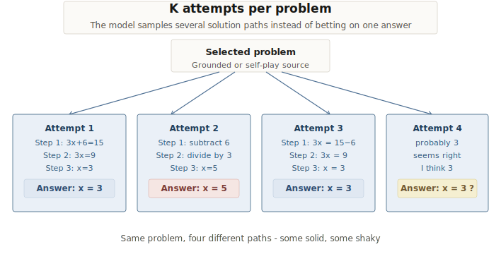
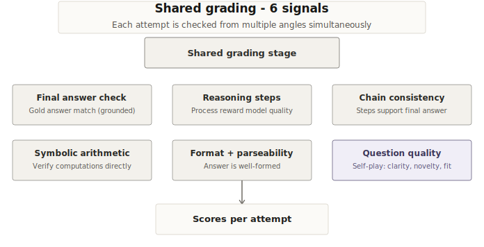
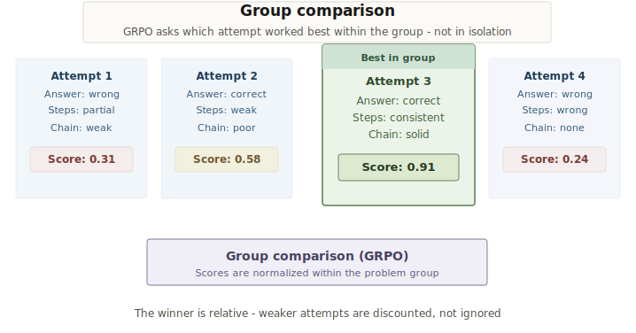
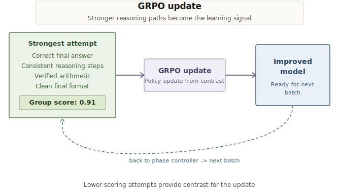
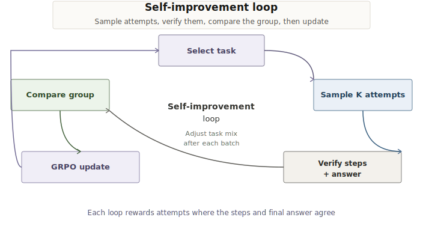
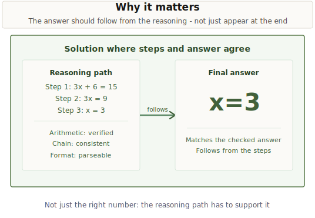
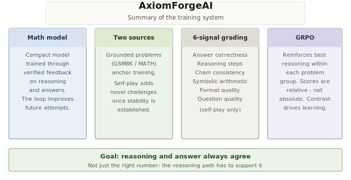

# AxiomForgeAI: Self-Improving Math Models Need More Than the Final Answer

Math models have a strange failure mode.

They can write a solution that looks careful, step-by-step, and confident, then end with the wrong answer. They can also produce the right final number with reasoning that is incomplete, inconsistent, or impossible to trust.

For math, that gap matters. The final answer is not enough. A proof, derivation, or word-problem solution only becomes useful when the path and the answer support each other.

AxiomForgeAI is built around that idea.

Instead of treating math reasoning as a one-shot generation problem, AxiomForgeAI turns it into a practice environment. The model does not simply answer a question and move on. It attempts the same problem multiple ways, receives feedback on both the reasoning path and the final answer, and learns from the attempts where the two agree.

## The training flow in ten points

### 1. The failure mode

The first point shows the problem AxiomForgeAI is built around. A model can produce steps that look plausible while ending with the wrong answer. A model can also produce the right answer with reasoning that is too weak to trust. In math, both cases are failures because the answer and the path need to agree.

### 2. The phase controller

Training does not jump straight into self-play. A phase controller decides the task mix for each batch. Early training stays grounded so the model learns stable answer and reasoning behavior. Self-play enters only after the grounded signal is strong enough, and fallback logic can return training to grounded-only practice if answer quality drops.

### 3. Two sources of practice

The environment has two ways to create practice. Grounded practice uses dataset problems from GSM8K or MATH with a hidden gold answer. Self-play uses a curriculum instruction with a target skill and difficulty, then asks the model to write a new question. Both sources eventually produce solution attempts that can be graded.

### 4. Several attempts instead of one

For each selected problem, the model samples multiple solution attempts. This matters because a single answer gives very little training signal. A group of attempts shows contrast. Some paths are clean, some drift, and some guess without enough reasoning.

### 5. Shared grading

Each attempt is checked from several angles. The environment can check the final answer when a gold answer exists, score the reasoning steps, inspect whether the chain supports the final answer, verify arithmetic where possible, and check whether the final answer is parseable. For self-play, the generated question also has to be clear, novel, on-topic, and solvable.

### 6. Group comparison

GRPO uses comparison inside the group. The strongest attempt is not judged in isolation. It is stronger relative to the other attempts for the same problem. This is the useful signal. The model learns which reasoning path was more correct, more consistent, and easier to verify.

### 7. The update

After comparison, the strongest reasoning path becomes the direction for the update. Weaker attempts still matter because they create contrast. The model is pushed toward solutions that have correct answers, consistent steps, verified arithmetic, and clean final formatting.

### 8. The loop

The full loop is simple. Select a task, sample multiple attempts, verify the steps and answer, compare the group, apply the GRPO update, and adjust the next task mix. This is the shift from answering to practicing.

### 9. The target behavior

The target is not a long explanation. The target is a solution where the reasoning path and final answer agree. The final answer should follow from the steps, and the steps should survive checking.

### 10. The whole system

The full system combines a compact math model, grounded practice, self-play practice, multi-signal grading, and GRPO. The point is not to make the model sound more confident. The point is to make the model better at producing reasoning chains that actually lead to the answer.

## Why the 1.5B constraint matters

AxiomForgeAI is intentionally built around a compact math model.

That constraint makes the problem more interesting. A smaller model cannot rely on scale alone to smooth over reasoning mistakes. If the setup is wrong, if the arithmetic drifts, or if the final answer does not follow from the steps, the environment has to catch it and turn it into a learning signal.

The point is not that a compact model magically solves math. The point is that a compact model makes the training loop visible. Every improvement has to come from better practice, better verification, and better selection of reasoning paths.

## What the model learns from

AxiomForgeAI rewards attempts that are mathematically useful, not just polished.

The environment checks whether the final answer matches when a gold answer exists. It also looks at the reasoning process, whether the chain stays consistent, whether arithmetic can be verified, and whether the final answer can be parsed cleanly.

For self-generated problems, the environment also asks whether the question itself is worth practicing. A useful question should be clear, solvable, on-topic, appropriately difficult, and not just a duplicate of what the model has already seen.

In other words, the model is learning two connected skills.

1. Solve math problems with reasoning that supports the answer.
2. Generate practice problems that are actually useful for learning.

## Where Examples Will Go

This section will include real model responses from the run.

- an example where the model had good steps but a wrong final answer
- an example where the model guessed correctly but the reasoning was weak
- an example after training where the reasoning chain and final answer agree
- a self-generated problem that passed the quality checks

These examples are important because the project is not only about a metric. The clearest evidence is seeing the model become better at making the path and the answer line up.

## Why This Matters

Math is a good starting point because mistakes are often checkable. Arithmetic can be verified. Final answers can be compared. Reasoning steps can be scored. That makes math a clean domain for building self-improvement loops.

But the pattern is bigger than math.

Many useful AI tasks have the same structure. Generate an attempt, check it, compare it against alternatives, and reinforce the better path. Code, logic, structured data transformation, and scientific problem solving all benefit from environments where progress can be verified.

AxiomForgeAI is one version of that pattern. It asks a simple question.

> What if a model could practice until its reasoning and answers agreed?

That is the loop this project builds.
