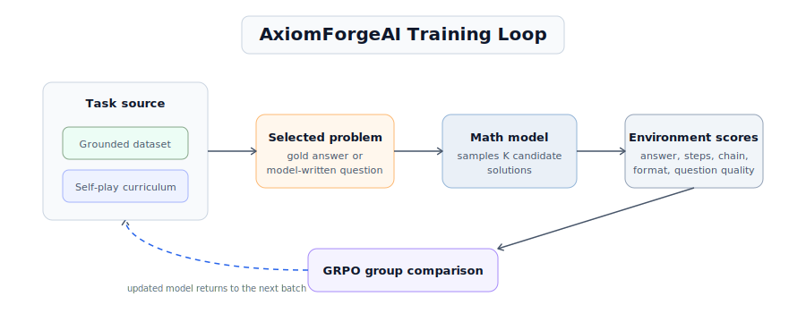
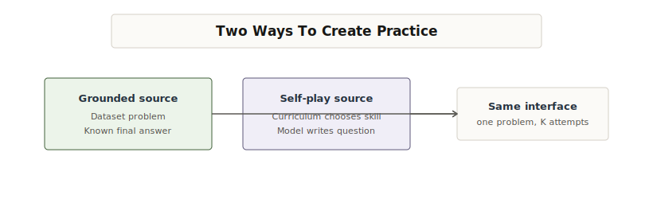
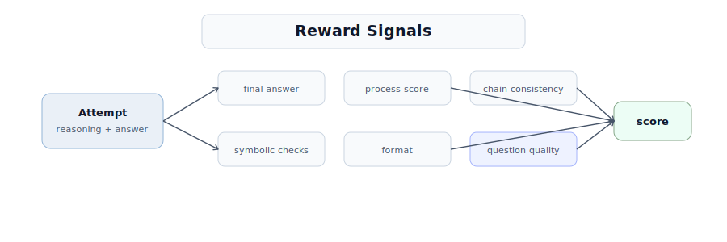
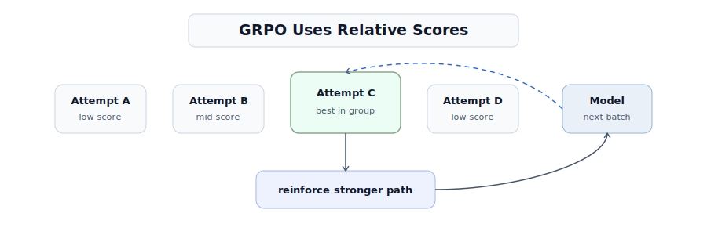
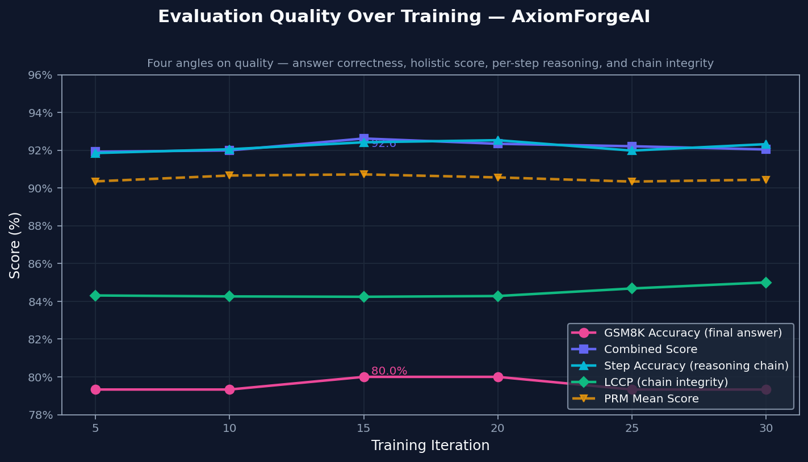
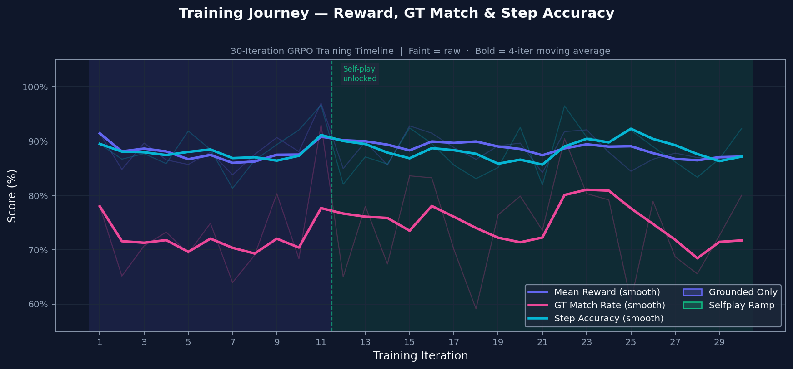
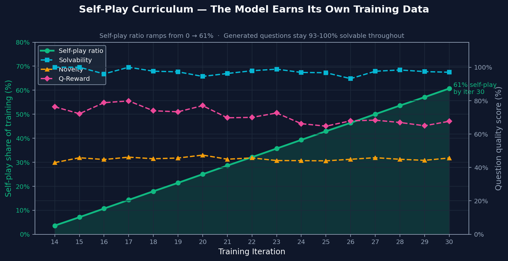
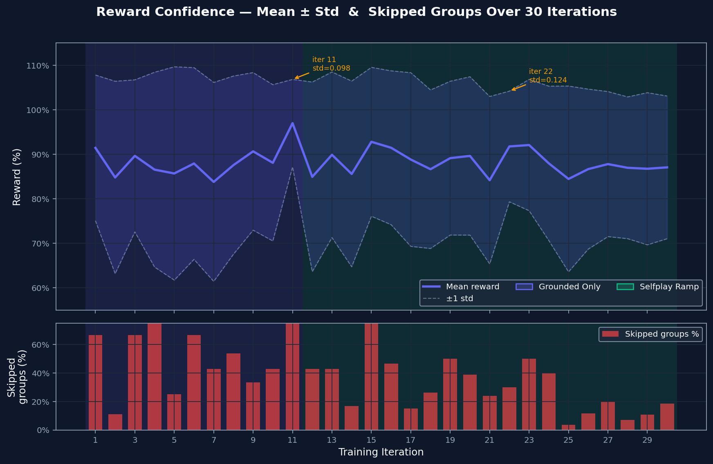
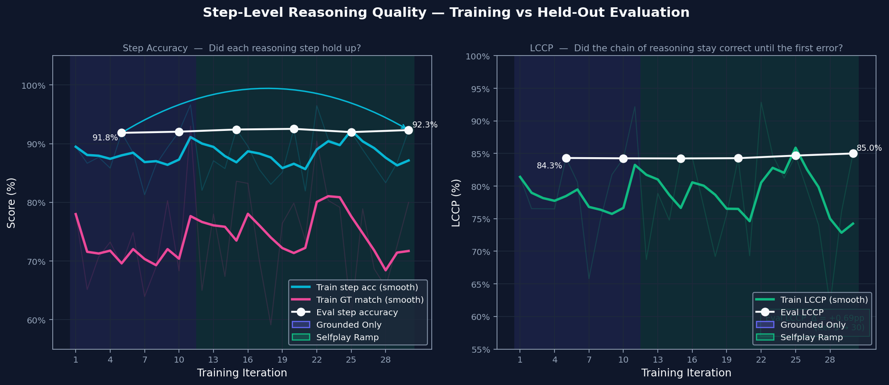

# AxiomForgeAI: Self-Improving Math Models Need More Than the Final Answer

Math models have a strange failure mode.

They can write a solution that looks careful, step-by-step, and confident, then end with the wrong answer. They can also produce the right final number with reasoning that is incomplete, inconsistent, or impossible to trust.

For math, that gap matters. The final answer is not enough. A proof, derivation, or word-problem solution only becomes useful when the path and the answer support each other.

AxiomForgeAI is built around that idea.

Instead of treating math reasoning as a one-shot generation problem, AxiomForgeAI turns it into a practice environment. The model does not simply answer a question and move on. It attempts the same problem multiple ways, receives feedback on both the reasoning path and the final answer, and learns from the attempts where the two agree.

[GitHub Code](https://github.com/Prem01-cyber/AxiomForgeAI)

[Hugging Face Space](https://huggingface.co/spaces/jampuramprem/AxiomForgeAI)

## The Architecture

AxiomForgeAI is a phase-controlled practice loop. It starts with grounded-only training, ramps self-play once grounded answer and step quality are stable, then keeps a grounded fallback if quality drops. Each selected problem is solved multiple ways, scored, and compared with GRPO.

Grounded problems come from GSM8K or MATH and include a known answer. Self-play problems start from a curriculum target, then the model writes the question. After either path produces one selected problem, the model samples `K` solution attempts.

Those attempts are scored for answer correctness, reasoning quality, chain consistency, formatting, and question quality when self-play is used. GRPO compares attempts only within the same problem group, so the learning signal is contrast: which reasoning path held together best.

## Grounded And Self-Play Practice

The grounded path is the anchor. It gives the reward system a known final answer, which keeps training tied to objective correctness while the model is still learning the format and reasoning style.

The self-play path adds new practice only after that anchor is stable. Here, the generated question is also judged before its solution reward is trusted. A useful self-play question should match the target topic, fit the target difficulty, be clear, be novel, and be solvable.

That is why self-play is not just “more data.” It is filtered practice. Bad questions do not become useful training signal just because the model wrote them.

## What Gets Checked

AxiomForgeAI does not rely on a single reward signal. Grounded attempts are anchored by the gold final answer, but the environment also checks whether the reasoning steps are valid, whether the correct prefix stays unbroken, and whether the final answer is parseable.

For self-play, the question is part of the reward too. The generated problem is checked for topic fit, difficulty fit, clarity, novelty, and solvability. The solution reward is still dominated by reasoning quality and chain integrity, and the question bonus is gated if the solution is broken.

The result is one score per attempt. That score becomes useful only because the model produced other attempts for the same problem, giving GRPO something to compare.

## Why GRPO Fits

GRPO turns a problem into a small comparison game. The model samples several attempts for the same prompt. Some are wrong, some are partially right, and one may be clearly better because the answer follows from the steps.

Instead of asking whether an attempt is good in isolation, GRPO asks which attempts are stronger relative to the rest of the group. That relative signal is exactly what this project needs. The model learns from contrast: this reasoning path held together better than the others.

After the update, the improved model goes back into the environment for the next batch. The curriculum can keep it grounded, introduce more self-play, or fall back to grounded-only practice if quality drops.

## Why the 1.5B Constraint Matters

AxiomForgeAI is intentionally built around a compact math model.

That constraint makes the loop easier to see. A smaller model cannot hide every reasoning mistake behind scale. If the setup is wrong, if the arithmetic drifts, or if the final answer does not follow from the steps, the environment has to catch it and turn it into feedback.

The point is not that a compact model magically solves math. The point is that improvement has to come from better practice, better verification, and better selection of reasoning paths.

## What the Model Learns From

AxiomForgeAI rewards attempts that are mathematically useful, not just polished.

The model learns to solve problems with reasoning that supports the answer. It also learns, during self-play, to generate practice problems that are worth solving. A useful self-generated problem should be clear, solvable, on-topic, appropriately difficult, and not just a duplicate of what the model has already seen.

That makes the loop different from ordinary fine-tuning. The model is not only seeing more answers. It is practicing, being checked, and learning from the solution paths that survived verification.

## Results

These plots come from a single GPU training run and focus on the core question: did the model get better at making its reasoning and final answer agree?

### Evaluation Quality Over Training

The environment tracks final correctness, solution quality, step validity, and how long the reasoning chain stays correct. All four move upward together, which suggests the model is not just finding better final answers. It is also producing reasoning that holds up longer.

### Training Journey

Training starts with grounded practice on problems with known answers. Self-play is introduced only after the grounded signal is stable, so the model does not train on its own generated problems too early. The transition is conditional, not just a timer.

### Self-Play Curriculum

By the end of training, most practice came from self-play. The important part is that generated problems stayed solvable and novel even after self-play became a larger share of training. That makes the ramp meaningful: self-play added useful practice instead of recycled noise.

### Reward Confidence

The reward spread shows how much contrast exists between the model's best and worst attempts. Wide spread gives GRPO something to learn from. Skipped groups are cases where attempts are too similar to compare usefully. That rate falls as harder material enters the curriculum, which suggests the comparison signal stays useful.

### Step-Level Reasoning Quality

Step accuracy checks whether each line of reasoning is valid. Chain integrity checks whether those valid steps form an unbroken path to the answer. Both improve together, which means the model is building solutions that hold together more often instead of only producing better-looking outputs.

## Why This Matters

Math is a good starting point because mistakes are often checkable. Arithmetic can be verified. Final answers can be compared. Reasoning steps can be scored. That makes math a clean domain for building self-improvement loops.

But the pattern is bigger than math.

Many useful AI tasks have the same structure. Generate an attempt, check it, compare it against alternatives, and reinforce the better path. Code, logic, structured data transformation, and scientific problem solving all benefit from environments where progress can be verified.

AxiomForgeAI is one version of that pattern. It asks a simple question.

> What if a model could practice until its reasoning and answers agreed?

That is the loop this project builds.
